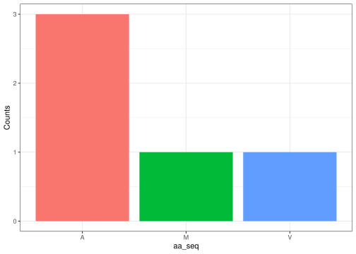

<!-- README.md is generated from README.Rmd. Please edit that file -->

# Centraldogmabio

``` r
library(Centraldogmabio)
```

# Introduction

The Centraldogmabio package is a tool for molecular biology and
bioinformatics. It provides a set of of functions with DNA, RNA and
amino acid sequences. This is the user guide for the package
functionalities. It will also demonstrate how each function can be used
individually and in conjunction with others.

# Functions Overview

## Function 1: Generate Random DNA Sequence

*‘generate_rand_DNA’*

Random Sequence Generation: The fourth function generates a random DNA
sequence of a desired length.

``` r
generate_rand_DNA(3)
#> [1] "CAC"
```

## Function 2: DNA to RNA Conversion

*‘dna_to_rna’*

Transcription: The second function transforms a DNA sequence into an RNA
sequence by replacing ‘T’ with ‘U’.

``` r
dna_to_rna("A C G T")
#> [1] "A C G U"
```

## Function 3: Generate Codons from a Genome

*‘generate_codon’*

Sequence manipulation: The third function generates codons from a given
sequence, with an optional starting position.

``` r
generate_codon("GTCGTC")
#> [1] "GTC" "GTC"
```

## Function 4: Codon to Amino Acid Conversion

*‘codon_to_aa’*

Translation: The first function converts a codon (sequence of 3
nucleotides) to its corresponding amino acid.

``` r
codon_to_aa("AUG")
#> [1] "M"
```

## Function 5:Amino Acid Proportion Plot

*‘aa_proportions’*

Visualization: The fifth function creates a bar chart displaying the
proportions of amino acids in a given sequence.

``` r
aa_proportions("MVAAA")
```



# Use Cases

The package can be used in bioinformatics task, such as DNA to protein
translation, codon anaysis and sequence visualization.

# Future Enhancements (other function)

1.  Reverse Transcription: Convert RNA back into DNA.
2.  Multiple Sequence Alignment: Function for comparing and aligning
    multiple DNA, RNA or protein sequences.
3.  Protein Properties: Calculate properties, such as molecular weight,
    secondary structure prediction, etc..

# Main points from discussion

In order to add the dependencies of the fifth function, we used the
following command line: `usethis::use_package("package_name")` This
command line was used for the packages `stringr` and `ggplot2`.

Having too many dependencies could result in dependency conflicts and
high memory usage. It also makes the code harder to maintain.

If many functions have the same name, using `package::function`instead
of `@importFrom package function` eliminates the ambiguity.
